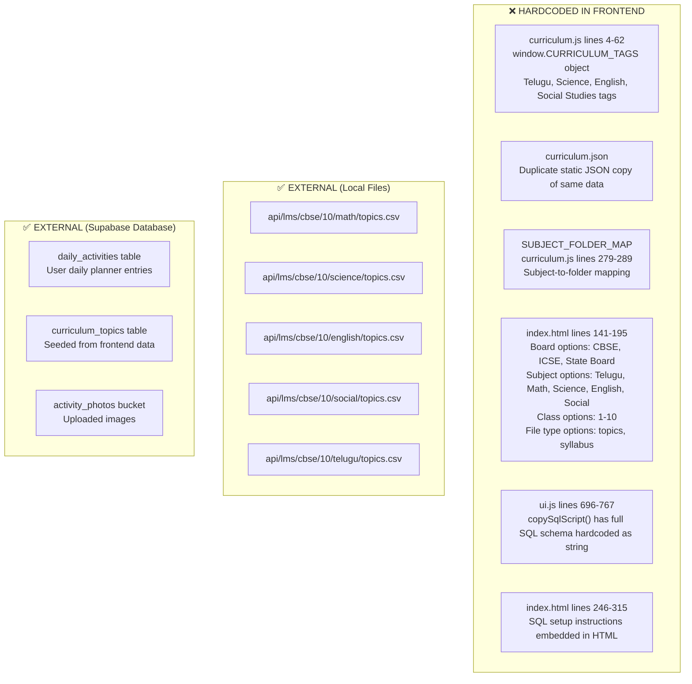
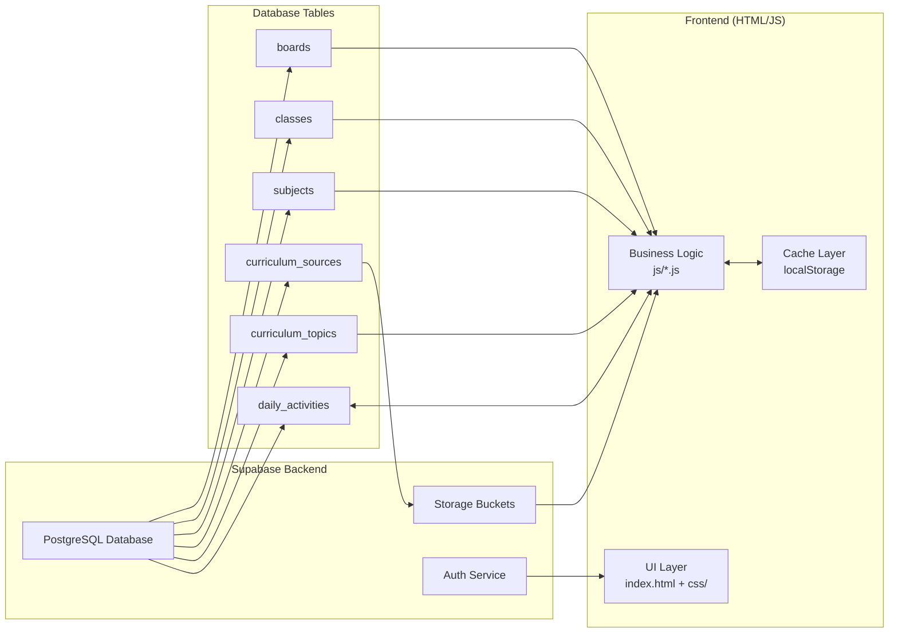
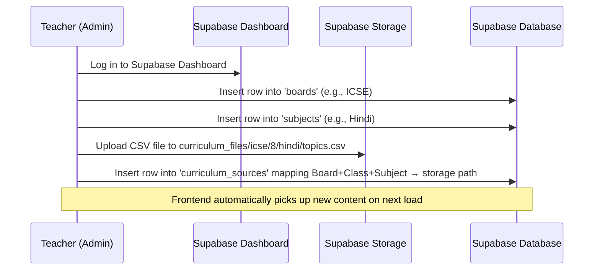
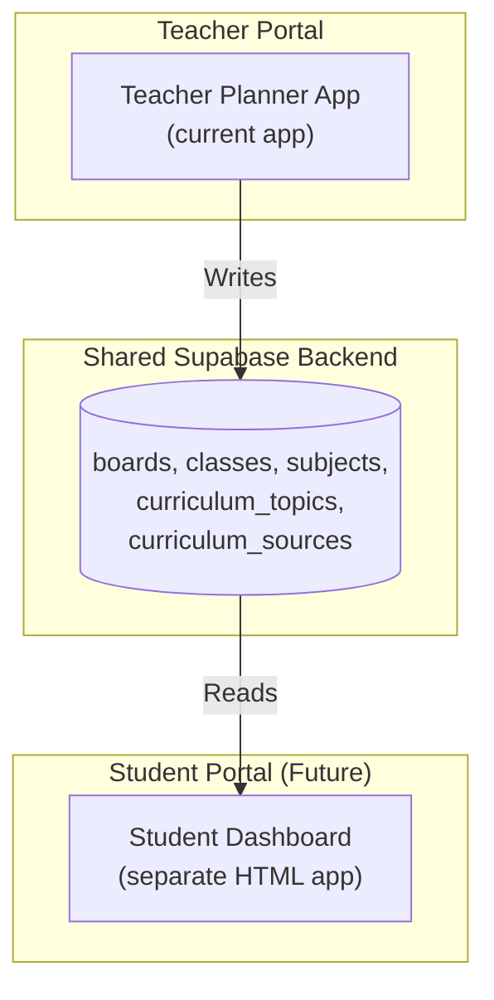

# EduFlow LMS — Architectural Analysis & Implementation Plan

## 1. Current Architecture Analysis

### 1.1 Project Overview

This is a **single-page HTML application** (no build tools, no framework) served by a static `http-server`. It consists of:

| File | Size | Role |
|---|---|---|
| [index.html](file:///d:/projects/html_teacher_diary-1/index.html) | 26 KB | Full UI layout: Daily Entry, View Activities, Settings, Auth Overlay |
| [js/data.js](file:///d:/projects/html_teacher_diary-1/js/data.js) | 4 KB | localStorage CRUD, settings, utility functions |
| [js/supabase.js](file:///d:/projects/html_teacher_diary-1/js/supabase.js) | 6 KB | Supabase client, push/pull sync for `daily_activities` |
| [js/auth.js](file:///d:/projects/html_teacher_diary-1/js/auth.js) | 11 KB | Authentication (Email/Google via Supabase Auth) |
| [js/ui.js](file:///d:/projects/html_teacher_diary-1/js/ui.js) | 34 KB | All UI rendering: Daily tab, View tab, Settings tab, Lightbox, SQL helper |
| [js/curriculum.js](file:///d:/projects/html_teacher_diary-1/js/curriculum.js) | 13 KB | Curriculum tag data, CSV parsing, local API path builder, DB seeder |
| [js/autocomplete.js](file:///d:/projects/html_teacher_diary-1/js/autocomplete.js) | 6 KB | Hashtag `#` autocomplete dropdown for classwork/homework fields |
| [js/csv.js](file:///d:/projects/html_teacher_diary-1/js/csv.js) | 5 KB | CSV export/import of daily activities |
| [js/toast.js](file:///d:/projects/html_teacher_diary-1/js/toast.js) | 1 KB | Toast notification system |
| [js/curriculum.json](file:///d:/projects/html_teacher_diary-1/js/curriculum.json) | 4 KB | Static JSON fallback of curriculum tags |
| [api/lms/cbse/10/\*/topics.csv](file:///d:/projects/html_teacher_diary-1/api/lms/cbse/10) | ~20 KB | Local CSV files (Math, Science, English, Social, Telugu) |

### 1.2 Where Educational Content Is Currently Stored



### 1.3 Specific Hardcoded Content Inventory

| Location | Content | Lines |
|---|---|---|
| [curriculum.js](file:///d:/projects/html_teacher_diary-1/js/curriculum.js#L4-L62) | `window.CURRICULUM_TAGS` — 5 subjects with topic tags | 4–62 |
| [curriculum.json](file:///d:/projects/html_teacher_diary-1/js/curriculum.json) | Duplicate JSON copy of curriculum tags (153 lines) | 1–153 |
| [curriculum.js](file:///d:/projects/html_teacher_diary-1/js/curriculum.js#L279-L289) | `SUBJECT_FOLDER_MAP` — subject name → folder mapping | 279–289 |
| [index.html](file:///d:/projects/html_teacher_diary-1/index.html#L146-L187) | Board/Class/Subject/FileType dropdown options | 146–187 |
| [index.html](file:///d:/projects/html_teacher_diary-1/index.html#L198-L210) | Teacher Subject dropdown options (Telugu, Math, Science, English, Social) | 198–210 |
| [index.html](file:///d:/projects/html_teacher_diary-1/index.html#L246-L315) | Full SQL DDL schema embedded as raw text | 246–315 |
| [ui.js](file:///d:/projects/html_teacher_diary-1/js/ui.js#L696-L767) | `copySqlScript()` — another full SQL schema copy hardcoded as JS string | 696–767 |
| [data.js](file:///d:/projects/html_teacher_diary-1/js/data.js#L11-L12) | Default Supabase URL and anon key hardcoded | 11–12 |

---

## 2. What Should Stay in the Frontend vs. Move Out

### ✅ KEEP in Frontend (UI + Business Logic)

| Component | Reason |
|---|---|
| Tab navigation & routing (`app.js`) | Pure UI orchestration |
| Daily entry form rendering (`ui.js: renderDailyTab`) | Presentation layer |
| View activities filtering/sorting (`ui.js: renderViewTab`) | Client-side filtering |
| Photo upload/compress/lightbox (`ui.js`) | Client-side image processing |
| Hashtag autocomplete engine (`autocomplete.js`) | UI interaction (but tags data should come from API) |
| CSV export/import of user data (`csv.js`) | User data portability |
| Toast notifications (`toast.js`) | UI feedback |
| Auth flow UI (`auth.js`) | Login/signup presentation |
| Supabase client wrapper (`supabase.js`) | Data sync service |
| localStorage data manager (`data.js`) | Offline-first cache |

### ❌ MOVE OUT of Frontend (Educational Content & Configuration)

| Content | Current Location | Should Move To |
|---|---|---|
| Curriculum topic tags | `curriculum.js` lines 4-62 | Supabase `curriculum_topics` table |
| Subject list (Telugu, Math, etc.) | `index.html` dropdown options | Supabase `subjects` table |
| Board list (CBSE, ICSE, etc.) | `index.html` dropdown options | Supabase `boards` table |
| Class list (1-10) | `index.html` dropdown options | Supabase `classes` table |
| Subject→folder mapping | `curriculum.js` lines 279-289 | Supabase `curriculum_sources` table |
| Local CSV files | `api/lms/cbse/10/*/topics.csv` | Supabase Storage bucket `curriculum_files` |
| SQL schema text | `index.html` + `ui.js` | External documentation / migration scripts |
| Default Supabase credentials | `data.js` lines 11-12 | Environment config or user-entered only |
| `curriculum.json` file | `js/curriculum.json` | DELETE entirely (redundant) |

---

## 3. Recommended Architecture

### 3.1 Target Data Flow



### 3.2 Supabase Database Schema

#### New Tables

```sql
-- ① Available boards
CREATE TABLE boards (
  id SERIAL PRIMARY KEY,
  name TEXT NOT NULL UNIQUE,        -- 'CBSE', 'ICSE', 'State Board'
  display_order INT DEFAULT 0,
  is_active BOOLEAN DEFAULT true
);

-- ② Available classes
CREATE TABLE classes (
  id SERIAL PRIMARY KEY,
  name TEXT NOT NULL UNIQUE,        -- '1', '2', ... '10'
  display_order INT DEFAULT 0,
  is_active BOOLEAN DEFAULT true
);

-- ③ Available subjects
CREATE TABLE subjects (
  id SERIAL PRIMARY KEY,
  name TEXT NOT NULL UNIQUE,        -- 'Mathematics', 'Science', etc.
  folder_key TEXT NOT NULL,         -- 'math', 'science', etc. (replaces SUBJECT_FOLDER_MAP)
  display_order INT DEFAULT 0,
  is_active BOOLEAN DEFAULT true
);

-- ④ Curriculum content source mapping (replaces local api/ folder)
CREATE TABLE curriculum_sources (
  id BIGSERIAL PRIMARY KEY,
  board_id INT REFERENCES boards(id),
  class_id INT REFERENCES classes(id),
  subject_id INT REFERENCES subjects(id),
  file_type TEXT NOT NULL DEFAULT 'topics',
  storage_path TEXT,                 -- path in Supabase Storage bucket
  external_url TEXT,                 -- OR an external API URL
  created_at TIMESTAMPTZ DEFAULT now(),
  UNIQUE (board_id, class_id, subject_id, file_type)
);

-- ⑤ Curriculum topics (existing, restructured)
CREATE TABLE curriculum_topics (
  id BIGSERIAL PRIMARY KEY,
  board_id INT REFERENCES boards(id),
  class_id INT REFERENCES classes(id),
  subject_id INT REFERENCES subjects(id),
  chapter_number INT,
  chapter_name TEXT,
  subtopic TEXT NOT NULL,
  topic_tag TEXT NOT NULL,           -- computed hashtag key
  display_order INT DEFAULT 0,
  created_at TIMESTAMPTZ DEFAULT now()
);

-- ⑥ daily_activities (existing, unchanged)
```

### 3.3 Supabase Storage

```
Bucket: curriculum_files (Public)
├── cbse/10/math/topics.csv
├── cbse/10/science/topics.csv
├── cbse/10/english/topics.csv
├── cbse/10/social/topics.csv
├── cbse/10/telugu/topics.csv
├── cbse/9/math/topics.csv          ← future additions
└── icse/10/math/topics.csv         ← future additions

Bucket: activity_photos (Public, existing)
└── activities/*.jpg
```

---

## 4. Recommended Frontend Folder Structure

```
html_teacher_diary/
├── index.html                  ← UI shell only (no educational content)
├── css/
│   └── styles.css
├── js/
│   ├── app.js                  ← Init, tab routing, event binding
│   ├── data.js                 ← localStorage CRUD (NO default credentials)
│   ├── supabase.js             ← Supabase client + push/pull
│   ├── auth.js                 ← Authentication
│   ├── ui.js                   ← UI rendering (Daily, View, Settings tabs)
│   ├── curriculum.js           ← API-only loader (NO hardcoded tags)
│   ├── config-loader.js        ← NEW: Fetches boards/classes/subjects from DB
│   ├── autocomplete.js         ← Hashtag autocomplete engine
│   ├── csv.js                  ← CSV export/import
│   └── toast.js                ← Notifications
└── (no api/ folder, no curriculum.json)
```

> [!IMPORTANT]
> The `api/` folder and `curriculum.json` are **deleted entirely**. All CSV files move to Supabase Storage. All dropdown options are populated dynamically from database tables.

---

## 5. How Teachers Should Create & Manage Content

### Content Management Workflow



### Two approaches for managing content:

**Option A: Supabase Dashboard (Current Simplest)**
- Teachers with admin access go to the Supabase Dashboard
- Add new rows to `boards`, `subjects`, `classes` tables
- Upload CSV files to the `curriculum_files` storage bucket
- Add mapping rows to `curriculum_sources`

**Option B: Admin Panel in the App (Future Enhancement)**
- Build an admin tab inside the Teacher Planner
- Only users with an `admin` role can access it
- Forms to add boards, classes, subjects, and upload CSVs
- All writes go through Supabase with proper RLS policies

---

## 6. How Students Should Receive Content

Currently this app is **Teacher-only** (daily planner). If a Student portal is planned:



- Students would have **read-only access** to `curriculum_topics`, `subjects`, etc.
- Teachers write daily activities; Students read shared curriculum content
- RLS policies enforce: Teachers write their own data, Students read shared content

---

## 7. Integration with Existing Supabase Setup

### What Changes

| Current | Proposed |
|---|---|
| Supabase URL + Key hardcoded in `data.js` | User enters credentials on first use; stored in localStorage only |
| `curriculum_topics` has flat `subject TEXT` | Normalized with `subject_id INT` referencing `subjects` table |
| Dropdown options hardcoded in HTML | Fetched from `boards`, `classes`, `subjects` tables on page load |
| CSV files in local `api/` folder | Uploaded to Supabase Storage `curriculum_files` bucket |
| `curriculum.json` as fallback | Deleted; fallback is empty state with helpful message |
| `SUBJECT_FOLDER_MAP` in JS | `folder_key` column in `subjects` table |
| SQL schema in HTML/JS strings | Separate `migrations/` folder with `.sql` files (not shipped to browser) |

### Migration Steps (Ordered)

1. Create new tables (`boards`, `classes`, `subjects`) in Supabase
2. Seed them with initial data (CBSE, ICSE, State Board; 1-10; Telugu, Math, etc.)
3. Upload existing CSV files from `api/` folder to Supabase Storage
4. Add mapping rows to `curriculum_sources`
5. Create new `js/config-loader.js` that fetches dropdown data from DB
6. Update `curriculum.js` to resolve CSV URLs from Supabase Storage
7. Update `index.html` to render dropdowns dynamically (empty `<select>` tags)
8. Remove all hardcoded content from `curriculum.js`, `curriculum.json`, `index.html`
9. Remove the `api/` folder from the project
10. Remove default Supabase credentials from `data.js`

---

## 8. Architectural Best Practices Recommended

### 8.1 Separation of Concerns

| Layer | Responsibility | Files |
|---|---|---|
| **Configuration** | What boards/classes/subjects exist | `config-loader.js` → Supabase tables |
| **Data Fetching** | Resolving and downloading CSV content | `curriculum.js` → Supabase Storage |
| **CSV Parsing** | Transforming raw CSV into structured tags | `curriculum.js: parseTopicsCSV()` |
| **Presentation** | Rendering UI, handling user interactions | `ui.js`, `autocomplete.js` |
| **Persistence** | Saving/loading user data | `data.js` (localStorage) + `supabase.js` (cloud) |

### 8.2 Caching Strategy

```
1. On first load → fetch boards/classes/subjects from Supabase → cache in localStorage
2. On subsequent loads → use cached data → refresh in background (stale-while-revalidate)
3. Curriculum CSV → cache parsed topics in localStorage with TTL (e.g., 24 hours)
4. Settings button "🔄 Fetch Latest Now" → force-refresh all caches
```

### 8.3 Error Handling Improvements

- **No Supabase configured**: Show setup wizard, not broken UI
- **Table doesn't exist**: Specific error message with link to SQL setup docs
- **No CSV file found**: "No curriculum configured for CBSE Class 10 Science. Ask your admin to upload it."
- **Network offline**: Gracefully fall back to cached data with "offline" indicator

### 8.4 Security

- **Remove hardcoded Supabase credentials** from `data.js` — these are currently committed to git
- **RLS policies**: `boards`, `classes`, `subjects` → public read, admin write; `daily_activities` → user-scoped read/write
- **Storage policies**: `curriculum_files` → public read, authenticated write

---

## 9. Open Questions for You

> [!IMPORTANT]
> **Q1: Student Portal** — Is a separate Student-facing portal planned? If yes, should it share the same Supabase project and tables?

> [!IMPORTANT]
> **Q2: Content Management** — Who will manage curriculum content (add boards, subjects, upload CSVs)? Should this be done through the Supabase Dashboard, or do you want an admin panel built into the app?

> [!IMPORTANT]
> **Q3: Migration** — The existing `curriculum_topics` table has flat `subject TEXT` columns. Should we migrate it to use normalized foreign keys, or keep the simple flat structure for now?

> [!IMPORTANT]
> **Q4: Default Credentials** — The Supabase URL and anon key are currently hardcoded in [data.js line 11-12](file:///d:/projects/html_teacher_diary-1/js/data.js#L11-L12) and committed to git. Should these be removed so each user enters their own, or is this a single-tenant app where hardcoding is acceptable?
